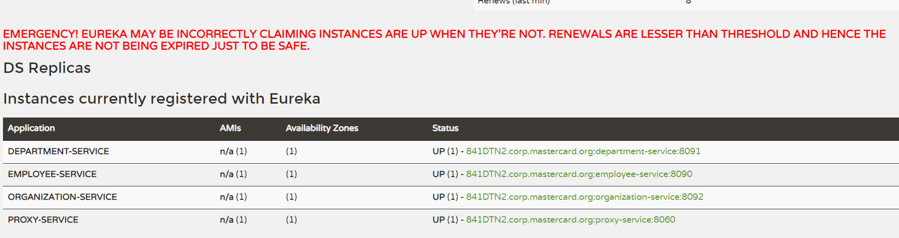

# What is the difference between an API-Gateway and an Edge Service?

Technically, an API Gateway is the API exposed to the public (REST, etc.), and an Edge Service is a service running on the API resolving the proxying, routing, etc. There could be many edge services on the Gateway. But practically there is usually only one service, logic, on the Gateway thus API Gateway = Edge Service.

# API proxy or gateway?
Gently paraphrasing Wikipedia, a proxy is something that acts as an intermediary, making requests on behalf of something else (there are some pretty good definitions in the terminology section of the W3C HTTP standard). What this means to us in the API world, is that when you’re using an API proxy, your API had better already exist, i.e. while a proxy can add some capabilities, like some basic security and monitoring, it really can’t do anything particularly sophisticated with content or routing, let alone transformation, mediation, or orchestration.

In simple terms you can think of the Proxy providing you a new endpoint for an existing API and adding some lightweight security and monitoring.


An API gateway on the other hand provides a much richer set of capabilities. When you use an API gateway to expose an API, you don’t even need to start with an API. You can take multiple existing services of varying types, and use the gateway to construct a modern, well-structured API. The gateway, of course, still offers the same capabilities that an API proxy would offer for security and monitoring, but it takes these and other capabilities much further.


So given that the API gateway is so much functionally richer than a proxy, why wouldn’t you always use a gateway?

Well, according to some vendors, gateway products are slow and unwieldy, with complex configuration and poor performance. The truth is actually the opposite. A well-designed and implemented gateway, like Akana API Gateway, will automatically optimize its configuration depending on how it’s being used. It can act as a simple, lightweight proxy, offering exceptional performance, or when needed it can offer comprehensive service orchestration, transformation, mediation, DoS prevention (including things like anti-virus, and threat detection), along with incredibly rich content and transport security capabilities that go far beyond anything a simple proxy can offer.

But, I hear you saying, how do vendors with proxy servers do things like SOAP to REST mediation? It’s simple, they write code that their customers have to support, or pay for updates anytime something changes. Using an API gateway, like Akana API Gateway, you can turn your existing services into exceptional APIs with sophisticated security and monitoring enabled in a matter of minutes. Try that with a proxy and you’ll quickly find yourself investing a good few weeks or even months writing code, only to do it all over again every single time you need to make a minor change.

While a proxy may be a good solution for taking the first few simple steps with a basic API or two, to meet real enterprise needs you’re going to need an API gateway, but you’d better make sure you choose a gateway that knows when it needs to act like a nice simple proxy…

#App Architecture:


High Level FLow:
We will discuss it from the organization-service point of view. 
- After starting organization-service connects to config-service available under address localhost:8088
- Basing on remote configuration settings it is able to register itself in Eureka.
- When the endpoint of organization-service is invoked by external client via gateway/Proxy Service  (3) available under address localhost:8060, the request is forwarded to instance of organization-service basing on entries from service discovery (4).
- Then organization-service lookup for address of department-service in Eureka (5), and call its endpoint (6).
- Finally department-service calls endpont from employee-service. The request as load balanced between two available instance of employee-service by Ribbon (7)


# Spring Eureka !

http://localhost:8061/




# Swagger UI

http://localhost:8060/swagger-ui.html


Now, let’s call endpoint ``http://localhost:8060/organization/1/with-departments-and-employees``

```
{
    "id": 1,
    "name": "Microsoft",
    "address": "Redmond, Washington, USA",
    "departments": [
        {
            "id": 1,
            "name": "Development",
            "employees": [
                {
                    "id": 1,
                    "name": "John Smith",
                    "age": 34,
                    "position": "Analyst"
                },
                {
                    "id": 2,
                    "name": "Darren Hamilton",
                    "age": 37,
                    "position": "Manager"
                },
                {
                    "id": 3,
                    "name": "Tom Scott",
                    "age": 26,
                    "position": "Developer"
                }
            ]
        },
        {
            "id": 2,
            "name": "Operations",
            "employees": [
                {
                    "id": 4,
                    "name": "Anna London",
                    "age": 39,
                    "position": "Analyst"
                },
                {
                    "id": 5,
                    "name": "Patrick Dempsey",
                    "age": 27,
                    "position": "Developer"
                }
            ]
        }
    ],
    "employees": [
        {
            "id": 1,
            "name": "John Smith",
            "age": 34,
            "position": "Analyst"
        },
        {
            "id": 2,
            "name": "Darren Hamilton",
            "age": 37,
            "position": "Manager"
        },
        {
            "id": 3,
            "name": "Tom Scott",
            "age": 26,
            "position": "Developer"
        },
        {
            "id": 4,
            "name": "Anna London",
            "age": 39,
            "position": "Analyst"
        }
    ]
}
```

